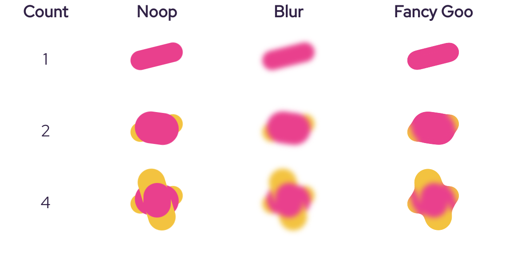
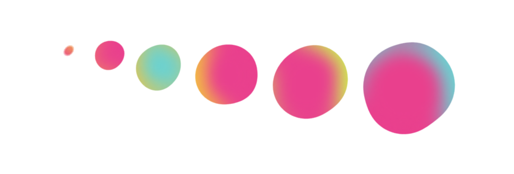
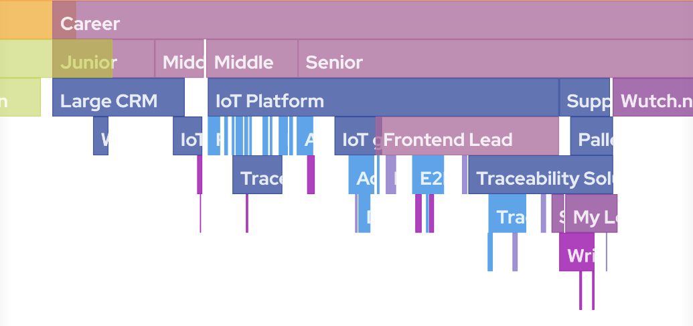

# av.codes

## Disclaimer

This personal site is created without any specific UI framework, just using core technologies and some helper libraries.

## Interesting Features

### Lava blobs

These are generated and animated procedurally with randomised amount and shape of participating elements. The core effect is implemented using a classic technique via the [SVG filters](./src/filters.pug) (blur + contrast).

The rest is achieved with tuning of the shapes, sizes, colors and animation timings to provide with "lava-lamp" like effect.

See the [source code](./src/mixins/shape.pug) for more details.

### Dynamic section splitters

Implemented using a similar technique as the blobs, but with a different set of initial transforms and layout for the underlying elements

Example of a section splitter without the filters applied

### Visualisations

#### Career Timeline

- Detects if User tries to scroll through the page on mobile while tapping within the visualisation using [gesture detection](./src/lib/PointerTracker.ts)
- Fancy dynamic resize
- Game-engine like scene/component architecture with draw/update loop
  - [Scene](./src/lib/Scene.ts) - ECS-like scene implementation
    - [Drawable](./src/lib/Drawable.ts), [Transformable](./src/lib/Transformable.ts), [Updatable](./src/lib/Updatable.ts) interfaces for the visualisation components
  - LERP for [values](./src/lib/InterpolatedValue.ts) and [transforms](./src/lib/SmoothTransform.ts)

See the [source code](./src/career/TimelineVisualisation.ts) for more details.

